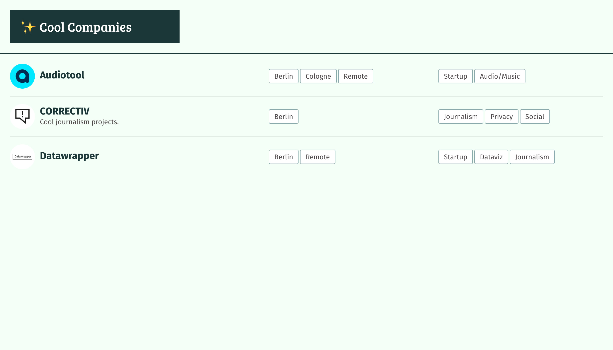

# Cool companies

List of cool companies. Mostly a little pet project to try out [Svelte](https://svelte.dev/). The data is currently coming from a private Contentful instance.




## Development

1. Create an `.env` file in the root directory by copying the `.env.example` file and filling out the variables.
2. Install dependencies via npm and run the local development server:

    ```shell
    npm install
    npm run dev
    ```

- Use the Svelte VS Code extension
- Use Prettier for formatting
